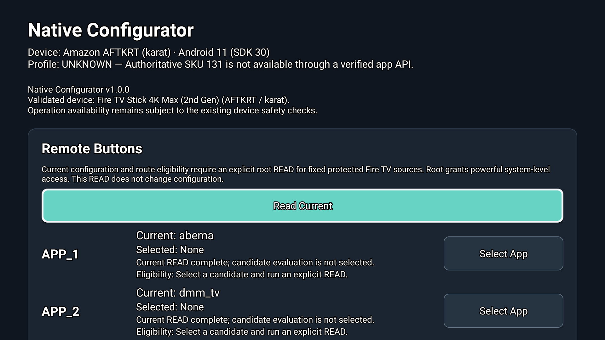
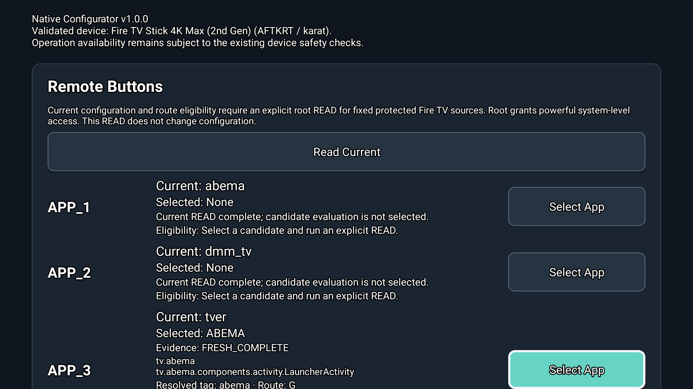
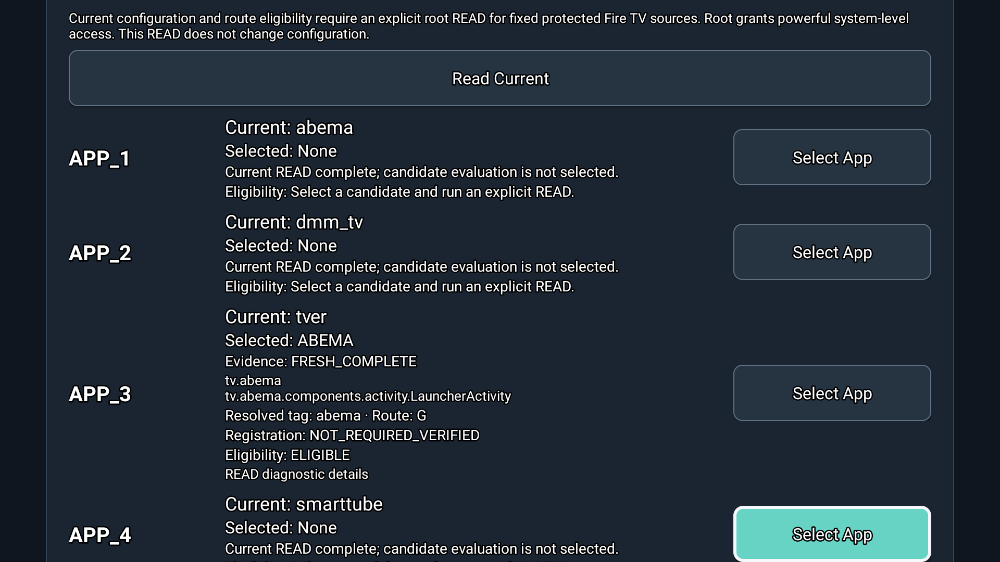
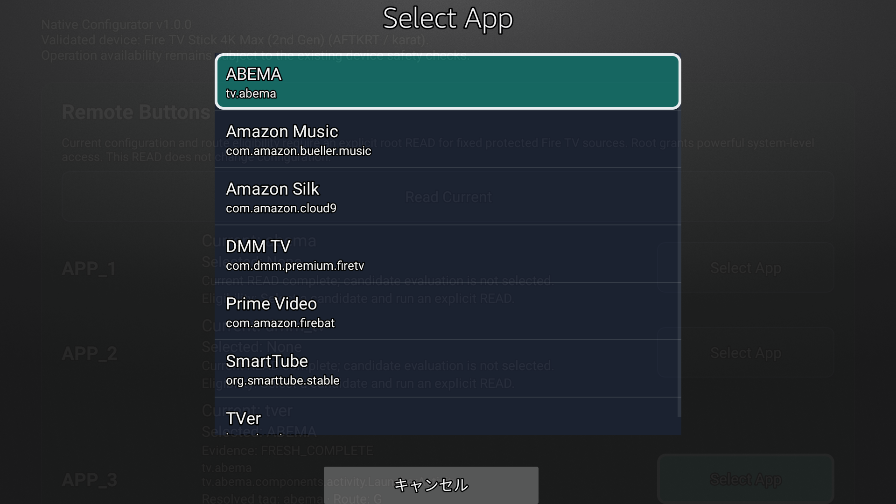
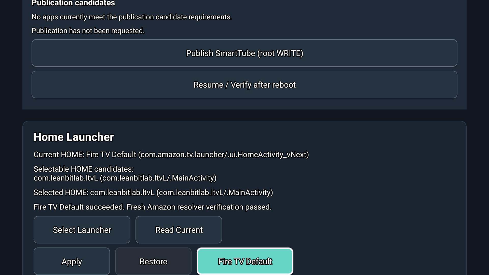
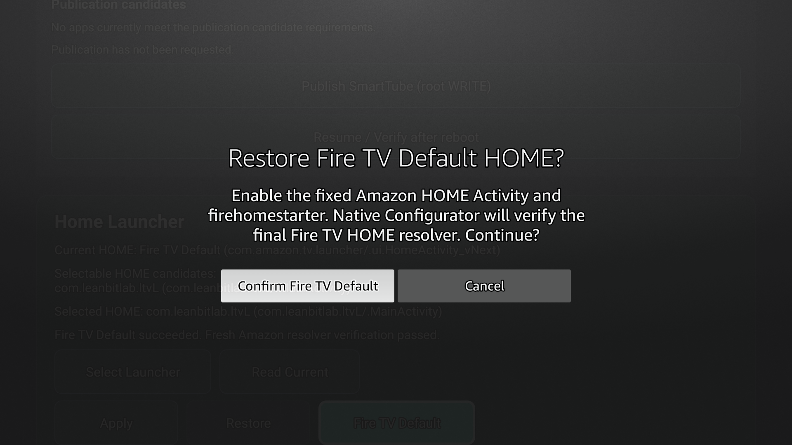
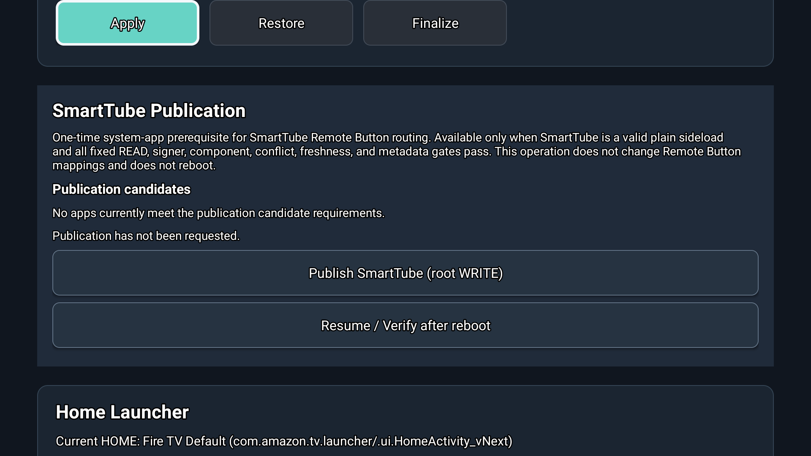

# Fire TV Native Configurator

A root-based GUI application for configuring Fire TV remote shortcut buttons and HOME launchers.

## Officially Supported Device

**Fire TV Stick 4K Max (2nd Generation) — AFTKRT / karat**

Tested on Fire OS 8.1.8.2.

Other models and Fire OS versions are not yet verified.

## Download

[Download Native Configurator v1.0.0](https://github.com/FIER-MONITOR01/FireTV-Native-Configurator/releases/tag/v1.0.0)

**Root access is required.**

## Features

- Remote Button Mapping: APP1–APP4
- Apply, Restore and Finalize for remote button changes
- HOME launcher selection and Fire TV Default recovery
- Publication for specifically verified application cases

## Known Issues (v1.0.0)

- In Remote Button Mapping, select the target application, then press **Read Current**, then **Apply**.
- Focus may unexpectedly move after Read Current.

Both UI issues are planned for improvement in the next update.

## Screenshots

### Main Screen

### Remote Button Mapping

### App Selection

### HOME Launcher

### Confirmation

### Publication

## Beta Testing

Additional Fire TV models and Fire OS versions are not officially supported yet. Testing feedback is welcome.

## Source Code

Source code is not publicly available at this time.
